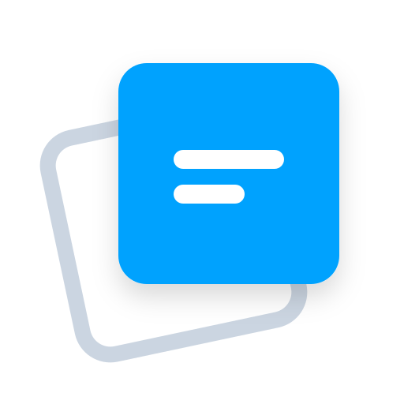

  
  <h1>FloatBoard Website</h1>
  
The official landing page and premium checkout portal for <a href="https://github.com/nazihyazan/floating_board">FloatBoard</a>.

  <!-- Badges -->
  

 

## 🌐 Overview
This repository contains the source code for the FloatBoard landing page. It showcases the application's features, offers download links for all platforms, and handles the secure checkout process for premium license keys.

  <!-- PUT YOUR LANDING PAGE SCREENSHOT LINK HERE -->
  

## 💳 Freemium Integration
The website is integrated directly with our licensing provider to enable the Freemium model:
- **`api/verify-lemon-key.js`**: Serverless function to securely validate license keys.
- **`api/create-checkout.js`**: Generates secure checkout sessions.
- **`api/webhook.js`**: Listens for successful purchases and provisions keys.

## 🛠️ Built With
- HTML5 & CSS3
- Vanilla JavaScript
- Vercel Serverless Functions (Node.js)

## 🔗 Links
- [Download FloatBoard](https://floatboard.xyz)
- [Main App Repository](https://github.com/nazihyazan/floating_board)

## 📄 Legal
- [Terms of Service](https://floatboard.xyz/terms.html)
- [Privacy Policy](https://floatboard.xyz/privacy.html)
